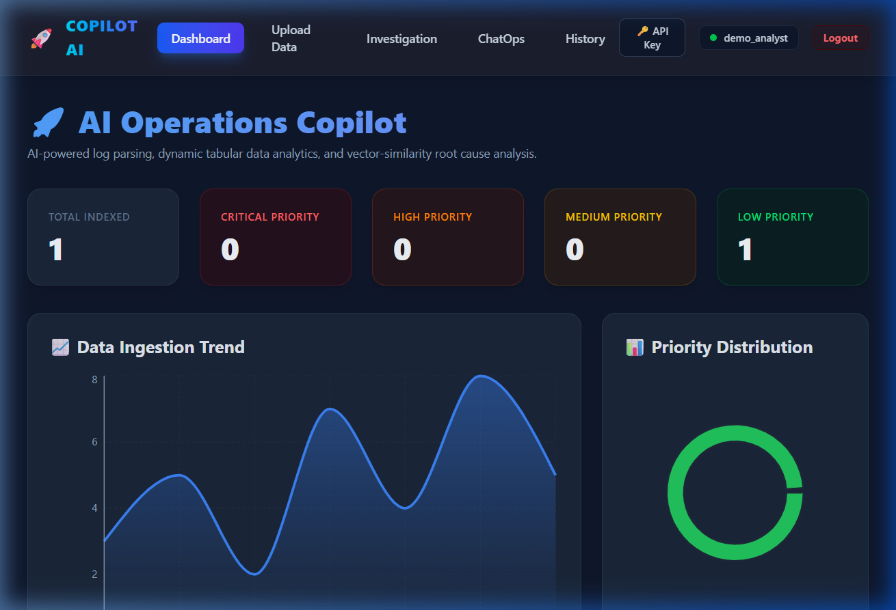
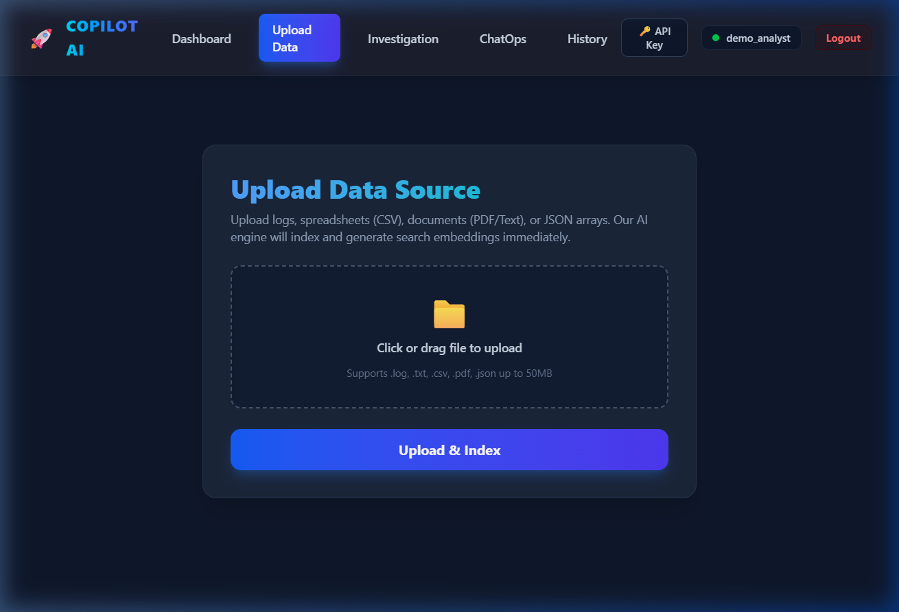
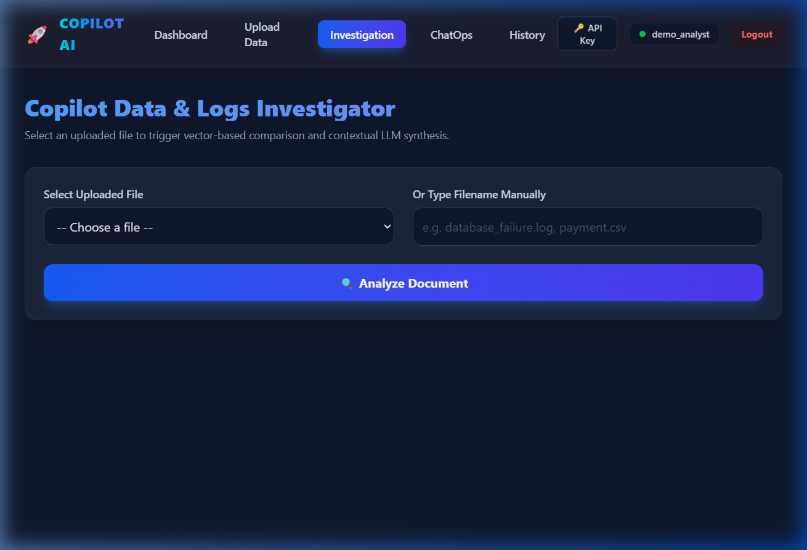
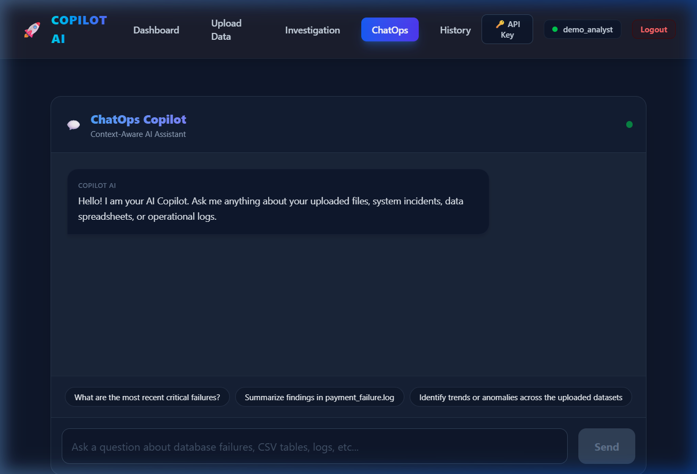
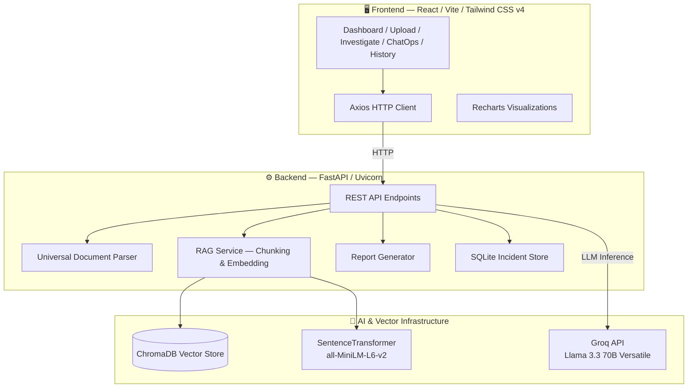

<p align="center">
  
  
  
  
  
  
</p>

<h1 align="center">🚀 Copilot AI — Universal Operations & Data Analyst Assistant</h1>

<p align="center">
  <strong>An intelligent, full-stack RAG (Retrieval-Augmented Generation) platform that ingests, chunks, indexes, and analyzes multi-format data files using local vector search and state-of-the-art LLMs.</strong>
</p>

<p align="center">
  <a href="#-key-features">Features</a> •
  <a href="#-screenshots">Screenshots</a> •
  <a href="#-architecture">Architecture</a> •
  <a href="#-tech-stack">Tech Stack</a> •
  <a href="#-getting-started">Getting Started</a> •
  <a href="#-project-structure">Project Structure</a> •
  <a href="#-sample-data">Sample Data</a> •
  <a href="#-api-reference">API Reference</a> •
  <a href="#-contributing">Contributing</a> •
  <a href="#-license">License</a>
</p>

---

## 📌 Problem Statement

Modern engineering and data teams drown in heterogeneous operational data — server logs, CSV exports, policy documents, JSON payloads — scattered across systems with no unified analysis layer. Teams waste hours manually parsing files, context-switching between tools, and writing one-off scripts to extract insights.

**Copilot AI** solves this by providing a single, intelligent interface that:
- **Ingests any file format** (`.log`, `.csv`, `.txt`, `.pdf`, `.json`)
- **Chunks and embeds** content into a local vector database for semantic search
- **Routes analysis dynamically** based on auto-detected document type
- **Generates structured reports** with actionable insights via LLM synthesis

---

## ✨ Key Features

| Feature | Description |
|---|---|
| 🔄 **Universal Data Ingestion** | Drag-and-drop upload supporting logs, CSV spreadsheets, PDF documents, JSON arrays, and plain text files |
| 🧠 **Context-Aware Analysis Routing** | Dynamic document classifier routes uploads to specialized LLM prompts — SRE incident analysis, tabular data audits, or general document synthesis |
| 🔍 **RAG-Powered Investigation** | Vector-similarity search against ChromaDB retrieves the most relevant chunks, then Groq's Llama 3.3 70B synthesizes structured analysis |
| 💬 **ChatOps Copilot** | Conversational AI assistant that queries your indexed data to answer operational questions with evidence-backed citations |
| 📊 **Real-Time Analytics Dashboard** | Interactive Recharts visualizations showing priority distributions, ingestion trends, and live activity streams |
| 📝 **Automated Report Generation** | One-click Markdown report generation with downloadable `.md` files streamed via HTTP attachments |
| 📁 **Analysis History** | Full history of all analyses with clickable drill-down into previous investigation results |

---

## 📸 Screenshots

<table>
  <tr>
    <td align="center"><strong>📊 Analytics Dashboard</strong></td>
    <td align="center"><strong>📤 Upload & Ingest</strong></td>
  </tr>
  <tr>
    <td></td>
    <td></td>
  </tr>
  <tr>
    <td align="center"><strong>🔍 Investigation View</strong></td>
    <td align="center"><strong>💬 ChatOps Assistant</strong></td>
  </tr>
  <tr>
    <td></td>
    <td></td>
  </tr>
</table>

---

## 🏗 Architecture



### Data Flow

```
User Upload → Format Detection → Chunking Strategy Selection
     ↓
  Log files     → 20-line sliding window chunks
  CSV files     → Row-level serialization with column headers
  PDF files     → Page-by-page text extraction (pypdf)
  JSON files    → Item-by-item serialized chunks
  Text files    → 20-line grouped chunks
     ↓
Embedding (all-MiniLM-L6-v2) → ChromaDB Vector Store
     ↓
Query → Top-K Similarity Search → LLM Context Injection → Structured Analysis
```

---

## 💻 Tech Stack

| Layer | Technology | Purpose |
|---|---|---|
| **Frontend** | React 18, Vite 5, React Router v7 | SPA with client-side routing |
| **Styling** | Tailwind CSS v4 | Utility-first responsive design system |
| **Charts** | Recharts | Interactive data visualizations |
| **Backend** | FastAPI, Uvicorn | High-performance async REST API |
| **Vector DB** | ChromaDB (local persistent) | Semantic similarity search |
| **Embeddings** | SentenceTransformers (`all-MiniLM-L6-v2`) | Local text vectorization |
| **LLM** | Groq API (Llama 3.3 70B Versatile) | Fast inference for analysis & chat |
| **Database** | SQLite | Lightweight incident metadata store |
| **PDF Parsing** | pypdf | Page-level text extraction |

---

## 🚀 Getting Started

### Prerequisites

- **Python** 3.10+
- **Node.js** 18+ and npm
- **Groq API Key** — [Get one free at console.groq.com](https://console.groq.com)

### 1. Clone the Repository

```bash
git clone https://github.com/DevilRK23/AI_Operations_copilot.git
cd AI_Operations_copilot
```

### 2. Backend Setup

```bash
cd backend

# Create virtual environment
python -m venv venv

# Activate (Windows)
.\venv\Scripts\activate
# Activate (macOS/Linux)
source venv/bin/activate

# Install dependencies
pip install -r requirements.txt

# Configure environment
echo "GROQ_API_KEY=your_key_here" > .env

# Start the server
uvicorn app:app --reload --port 8000
```

### 3. Frontend Setup

```bash
# Open a new terminal
cd frontend

# Install dependencies
npm install

# Start the dev server
npm run dev
```

### 4. Open the App

Navigate to **http://localhost:5173** in your browser. Upload any file from `backend/sample_data/` to get started immediately.

---

## 📂 Project Structure

```
AI_Operations_copilot/
│
├── backend/
│   ├── app.py                    # Core FastAPI application (30+ REST endpoints)
│   ├── requirements.txt          # Python dependencies
│   ├── index_logs.py             # Batch indexing verification utility
│   ├── services/
│   │   ├── log_parser.py         # Universal multi-format document parser
│   │   ├── rag_service.py        # ChromaDB chunking, embedding & search
│   │   ├── report_service.py     # Markdown report compiler
│   │   └── db_service.py         # SQLite incident CRUD operations
│   ├── sample_data/              # Ready-to-use test files
│   │   ├── checkout_failure.log  # E-commerce incident log trace
│   │   ├── sales_report.csv      # Transaction dataset with mixed statuses
│   │   └── api_retry_rules.txt   # Infrastructure policy document
│   ├── database/                 # SQLite database files
│   ├── uploads/                  # User-uploaded files (git-ignored)
│   └── vector_db/                # ChromaDB persistent storage (git-ignored)
│
├── frontend/
│   ├── src/
│   │   ├── components/
│   │   │   ├── Navbar.jsx            # Navigation bar with active route highlighting
│   │   │   ├── IncidentTrendChart.jsx # Weekly ingestion trend (Area Chart)
│   │   │   ├── SeverityChart.jsx      # Priority distribution (Donut Chart)
│   │   │   ├── RecentIncidents.jsx    # Recent uploads list with format badges
│   │   │   └── LiveIncidentFeed.jsx   # Real-time activity stream
│   │   ├── pages/
│   │   │   ├── Dashboard.jsx     # Main analytics dashboard
│   │   │   ├── UploadLog.jsx     # File upload with drag-and-drop
│   │   │   ├── Investigate.jsx   # RAG-powered analysis viewer
│   │   │   ├── ChatOps.jsx       # Conversational AI assistant
│   │   │   └── History.jsx       # Analysis history browser
│   │   ├── services/
│   │   │   └── api.js            # Axios client configuration
│   │   ├── App.jsx               # Route definitions
│   │   └── main.jsx              # Application entry point
│   ├── package.json
│   └── vite.config.js
│
├── screenshots/                  # Application screenshots for documentation
└── README.md
```

---

## 🧪 Sample Data

The project includes ready-to-use sample files in `backend/sample_data/` for immediate testing:

| File | Type | Description |
|---|---|---|
| `checkout_failure.log` | System Log | E-commerce checkout failure trace with timestamped ERROR/WARN/INFO entries |
| `sales_report.csv` | Tabular Data | Transaction dataset with columns: transaction_id, item_name, quantity, total_amount, payment_method, status |
| `api_retry_rules.txt` | Policy Document | Infrastructure retry policy with exponential backoff rules and escalation procedures |

Upload any of these through the **Upload Data** page to see the full analysis pipeline in action.

---

## 📡 API Reference

### Core Endpoints

| Method | Endpoint | Description |
|---|---|---|
| `POST` | `/upload` | Upload and index a file (multipart/form-data) |
| `POST` | `/investigate` | Trigger RAG analysis on an indexed file |
| `POST` | `/chat` | Send a message to the ChatOps assistant |
| `GET` | `/recent-incidents` | Fetch recently uploaded file metadata |
| `GET` | `/total-incidents` | Get total indexed document count |
| `GET` | `/incident-history` | Retrieve full analysis history |
| `GET` | `/priority-distribution` | Get severity/priority breakdown |
| `GET` | `/download-report/{filename}` | Download generated Markdown report |
| `GET` | `/uploaded-files` | List all uploaded files available for analysis |

### Example: Upload a File

```bash
curl -X POST http://localhost:8000/upload \
  -F "file=@backend/sample_data/sales_report.csv"
```

### Example: Investigate a File

```bash
curl -X POST http://localhost:8000/investigate \
  -H "Content-Type: application/json" \
  -d '{"query": "sales_report.csv"}'
```

### Example: ChatOps Query

```bash
curl -X POST http://localhost:8000/chat \
  -H "Content-Type: application/json" \
  -d '{"message": "What are the most recent critical failures?"}'
```

---

## 🔧 Configuration

| Variable | Required | Description |
|---|---|---|
| `GROQ_API_KEY` | ✅ | API key for Groq LLM inference ([console.groq.com](https://console.groq.com)) |

Create a `.env` file in `backend/`:

```env
GROQ_API_KEY=gsk_your_api_key_here
```

---

## 🤝 Contributing

Contributions are welcome! Please follow these steps:

1. **Fork** the repository
2. **Create** a feature branch (`git checkout -b feature/amazing-feature`)
3. **Commit** your changes (`git commit -m 'Add amazing feature'`)
4. **Push** to the branch (`git push origin feature/amazing-feature`)
5. **Open** a Pull Request

### Development Guidelines

- Follow PEP 8 for Python code
- Use ESLint configuration for JavaScript/React
- Write descriptive commit messages
- Test all API endpoints before submitting PRs

---

## 📄 License

This project is licensed under the MIT License — see the [LICENSE](LICENSE) file for details.

---

## 👥 Authors

- **Rithvik Kumar** — Full-Stack Development & System Architecture
- **Bhagyashree PY** — Backend Engineering & RAG Pipeline

---

<p align="center">
  <strong>⭐ If you found this project useful, please consider giving it a star!</strong>
</p>
